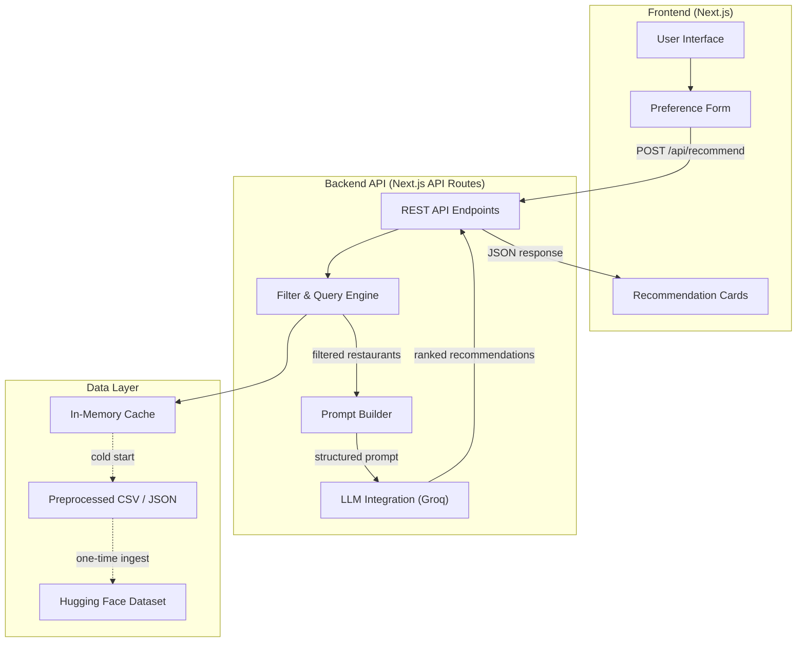
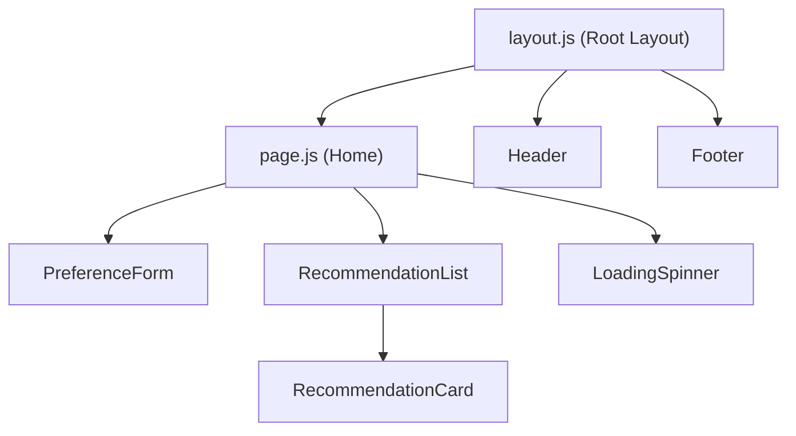
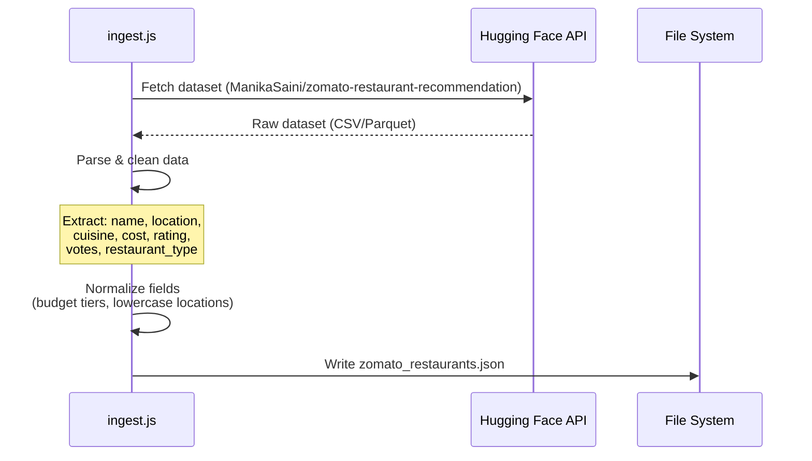
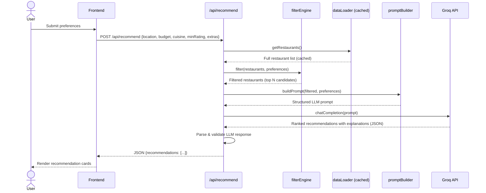
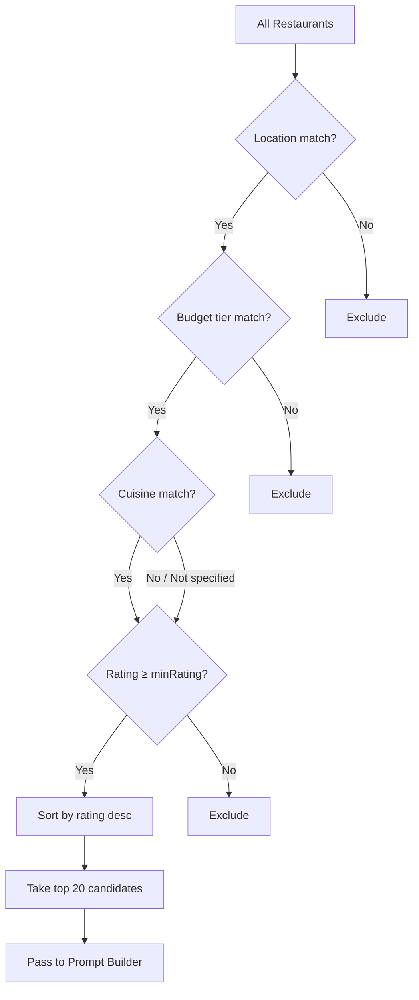

# Architecture: AI-Powered Restaurant Recommendation System

> Reference: [context.md](file:///c:/Users/rparv/.antigravity-ide/Zomato%20milestone-1/docs/context.md)

---

## 1. High-Level Architecture



---

## 2. Technology Stack

| Layer            | Technology                | Rationale                                                     |
|------------------|---------------------------|---------------------------------------------------------------|
| **Frontend**     | Next.js (React)           | SSR/SSG support, file-based routing, built-in API routes      |
| **Styling**      | Vanilla CSS               | Full control, no framework overhead, premium custom design    |
| **Backend**      | Next.js API Routes        | Co-located with frontend, serverless-friendly                 |
| **LLM**         | Groq API                  | Ultra-fast inference, generous free tier, structured output   |
| **Dataset**      | Hugging Face Datasets     | Pre-built Zomato dataset, easy programmatic access            |
| **Data Format**  | JSON (preprocessed)       | Fast in-memory filtering, no database dependency              |
| **Package Mgr**  | npm                       | Standard Node.js tooling                                      |
| **Deployment**   | Vercel / Local Dev Server | Zero-config Next.js deployment                                |

---

## 3. Directory Structure

```
Zomato milestone-1/
├── docs/
│   ├── context.md                 # Project context & problem statement
│   ├── architecture.md            # This file
│   └── problemstatement.txt       # Original problem statement
├── data/
│   └── zomato_restaurants.json    # Preprocessed dataset (generated at build)
├── scripts/
│   └── ingest.js                  # Dataset download & preprocessing script
├── src/
│   ├── app/
│   │   ├── layout.js              # Root layout (fonts, metadata, global styles)
│   │   ├── page.js                # Home page (preference form + results)
│   │   ├── globals.css            # Global styles & design tokens
│   │   └── api/
│   │       └── recommend/
│   │           └── route.js       # POST /api/recommend endpoint
│   ├── components/
│   │   ├── PreferenceForm.js      # User input form component
│   │   ├── RecommendationCard.js  # Single restaurant result card
│   │   ├── RecommendationList.js  # List/grid of recommendation cards
│   │   ├── Header.js              # App header/navbar
│   │   ├── Footer.js              # App footer
│   │   └── LoadingSpinner.js      # Loading state indicator
│   ├── lib/
│   │   ├── dataLoader.js          # Load & cache preprocessed restaurant data
│   │   ├── filterEngine.js        # Filter restaurants by user preferences
│   │   ├── promptBuilder.js       # Construct LLM prompt from filtered data
│   │   └── llmClient.js           # Groq API client wrapper
│   └── utils/
│       ├── constants.js           # App-wide constants (cuisines, cities, etc.)
│       └── helpers.js             # Shared utility functions
├── public/
│   └── assets/                    # Static images, icons, etc.
├── .env.local                     # API keys (GROQ_API_KEY)
├── next.config.js                 # Next.js configuration
├── package.json                   # Dependencies & scripts
└── README.md                      # Project setup & usage guide
```

---

## 4. Component Architecture

### 4.1 Frontend Components



| Component              | Responsibility                                                     |
|------------------------|--------------------------------------------------------------------|
| **PreferenceForm**     | Collects location, budget, cuisine, min rating, extra preferences  |
| **RecommendationCard** | Displays a single restaurant with name, cuisine, rating, cost, AI explanation |
| **RecommendationList** | Renders a grid/list of `RecommendationCard` components             |
| **LoadingSpinner**     | Animated loading indicator during API call                         |
| **Header**             | App branding, navigation                                           |
| **Footer**             | Credits, links                                                     |

### 4.2 Backend Modules

| Module              | File                  | Responsibility                                                    |
|---------------------|-----------------------|-------------------------------------------------------------------|
| **API Route**       | `route.js`            | Accepts POST request, orchestrates filter → prompt → LLM pipeline |
| **Data Loader**     | `dataLoader.js`       | Reads `zomato_restaurants.json`, caches in memory                 |
| **Filter Engine**   | `filterEngine.js`     | Applies location, budget, cuisine, rating filters                 |
| **Prompt Builder**  | `promptBuilder.js`    | Constructs a structured prompt with filtered restaurant data      |
| **LLM Client**      | `llmClient.js`        | Sends prompt to Groq API, parses structured response              |

---

## 5. Data Flow

### 5.1 Data Ingestion Pipeline (One-Time / Build-Time)



### 5.2 Recommendation Request Flow (Runtime)



---

## 6. API Contract

### `POST /api/recommend`

#### Request Body

```json
{
  "location": "Delhi",
  "budget": "medium",
  "cuisine": "Italian",
  "minRating": 4.0,
  "extras": "family-friendly, outdoor seating"
}
```

| Field        | Type     | Required | Description                                    |
|--------------|----------|----------|------------------------------------------------|
| `location`   | `string` | Yes      | City name (e.g., "Delhi", "Bangalore")         |
| `budget`     | `string` | Yes      | One of: `"low"`, `"medium"`, `"high"`          |
| `cuisine`    | `string` | No       | Preferred cuisine type                         |
| `minRating`  | `number` | No       | Minimum rating threshold (0–5), default `3.5`  |
| `extras`     | `string` | No       | Free-text additional preferences               |

#### Success Response (`200 OK`)

```json
{
  "recommendations": [
    {
      "rank": 1,
      "name": "La Piazza",
      "cuisine": "Italian",
      "rating": 4.5,
      "estimatedCost": "₹800 for two",
      "explanation": "La Piazza tops the list for its authentic wood-fired pizzas and elegant family-friendly ambiance in central Delhi. With a 4.5 rating and moderate pricing, it perfectly matches your Italian cuisine preference within a medium budget."
    }
  ],
  "summary": "Based on your preferences, here are the top Italian restaurants in Delhi...",
  "totalFiltered": 12,
  "timestamp": "2026-06-23T08:00:00.000Z"
}
```

#### Error Response (`400 / 500`)

```json
{
  "error": "Location is required",
  "code": "VALIDATION_ERROR"
}
```

---

## 7. Data Schema

### Restaurant Record (`zomato_restaurants.json`)

```json
{
  "id": "rest_001",
  "name": "La Piazza",
  "location": "delhi",
  "cuisine": ["Italian", "Continental"],
  "costForTwo": 800,
  "budgetTier": "medium",
  "rating": 4.5,
  "votes": 1200,
  "restaurantType": "Casual Dining",
  "highlights": ["Outdoor Seating", "Family Friendly"]
}
```

### Budget Tier Mapping

| Tier       | Cost for Two (₹)  |
|------------|--------------------|
| `low`      | ≤ 500              |
| `medium`   | 501 – 1500         |
| `high`     | > 1500             |

---

## 8. LLM Prompt Strategy

### Prompt Template Structure

```
SYSTEM:
You are a restaurant recommendation expert. Analyze the provided restaurant 
data and rank them based on the user's preferences. Return your response as 
valid JSON.

USER:
## User Preferences
- Location: {location}
- Budget: {budget}
- Cuisine: {cuisine}
- Minimum Rating: {minRating}
- Additional: {extras}

## Available Restaurants
{formattedRestaurantList}

## Instructions
1. Rank the top 5 restaurants that best match the user's preferences.
2. For each restaurant, provide a 2-3 sentence explanation of why it's a good fit.
3. Provide a brief overall summary.
4. Return the response in the following JSON format:
{responseSchema}
```

### Key Design Decisions

- **Structured output**: Request JSON from the LLM to enable reliable parsing
- **Context limiting**: Pass at most 20 filtered candidates to avoid token limits
- **Temperature**: Use low temperature (0.3) for consistent, factual recommendations
- **Safety**: Validate LLM response schema before returning to the client

---

## 9. Filtering Logic



### Filter Precedence

1. **Location** — mandatory, exact match (case-insensitive)
2. **Budget** — mandatory, tier-based mapping
3. **Cuisine** — optional, partial match against cuisine array
4. **Rating** — optional, minimum threshold filter
5. **Sort** — by rating descending, then by votes descending (tiebreaker)

---

## 10. Error Handling Strategy

| Scenario                  | Handling                                               |
|---------------------------|--------------------------------------------------------|
| Missing required fields   | Return `400` with validation error details             |
| No restaurants match      | Return `200` with empty array + helpful message        |
| LLM API failure           | Return `503` with retry-after header                   |
| LLM returns malformed JSON| Attempt repair parse; fallback to raw filtered results |
| Dataset file not found    | Return `500` with setup instructions                   |
| Rate limiting (Groq)      | Exponential backoff with 3 retries                     |

---

## 11. Performance Considerations

| Concern                  | Solution                                                |
|--------------------------|---------------------------------------------------------|
| Dataset load time        | Cache in-memory after first read (module-level cache)   |
| LLM latency (~2-5s)     | Show loading animation; stream response if possible     |
| Large dataset filtering  | Pre-index by location for O(1) lookup                   |
| Repeated queries         | Optional: cache LLM responses by preference hash        |
| Cold starts (serverless) | Keep dataset JSON small (< 5MB); lazy load              |

---

## 12. Security

| Concern             | Mitigation                                              |
|----------------------|---------------------------------------------------------|
| API key exposure     | Store `GROQ_API_KEY` in `.env.local`, never commit      |
| Prompt injection     | Sanitize user input; validate against allowed values    |
| Rate abuse           | Implement basic rate limiting on `/api/recommend`       |
| XSS                  | React auto-escapes; sanitize LLM output before render   |

---

## 13. Future Enhancements

- **User accounts & history**: Save past recommendations and preferences
- **Vector search**: Use embeddings for semantic restaurant matching
- **Multi-language support**: Localize UI and LLM prompts
- **Review integration**: Pull live reviews for richer context
- **Map view**: Display recommended restaurants on an interactive map
- **Comparison mode**: Side-by-side restaurant comparison
