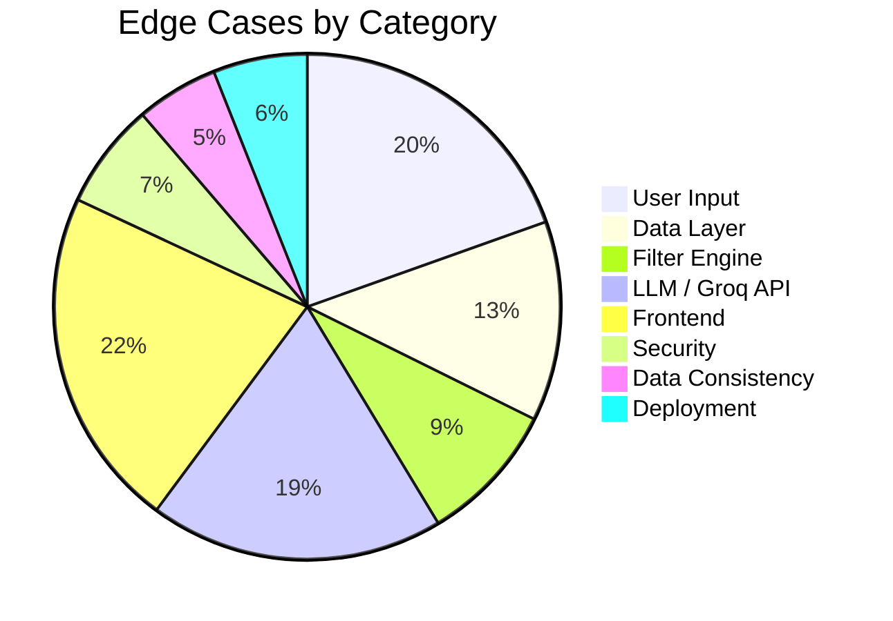

# Edge Cases & Corner Scenarios

> References: [architecture.md](file:///c:/Users/rparv/.antigravity-ide/Zomato%20milestone-1/docs/architecture.md) · [implementation-plan.md](file:///c:/Users/rparv/.antigravity-ide/Zomato%20milestone-1/docs/implementation-plan.md)

---

## 1. User Input Edge Cases

### 1.1 Missing / Empty Fields

| # | Scenario | Input | Expected Behavior |
|---|----------|-------|-------------------|
| 1 | Location is empty string | `{ "location": "", "budget": "medium" }` | Return `400 VALIDATION_ERROR` — "Location is required" |
| 2 | Location is only whitespace | `{ "location": "   ", "budget": "low" }` | Trim and treat as empty → `400 VALIDATION_ERROR` |
| 3 | Budget is missing | `{ "location": "Delhi" }` | Return `400 VALIDATION_ERROR` — "Budget is required" |
| 4 | Entire body is empty | `{}` | Return `400 VALIDATION_ERROR` — list all missing required fields |
| 5 | Body is `null` or not JSON | Raw text / `null` | Return `400` — "Invalid request body" |
| 6 | No body at all | `POST` with empty content | Return `400` — "Request body is required" |
| 7 | Cuisine is empty string | `{ "location": "Delhi", "budget": "low", "cuisine": "" }` | Treat as not provided — skip cuisine filter |
| 8 | Extras is empty string | `{ ..., "extras": "" }` | Treat as not provided — omit from LLM prompt |
| 9 | MinRating is `null` | `{ ..., "minRating": null }` | Use default value (`3.5`) |

---

### 1.2 Invalid / Malformed Values

| # | Scenario | Input | Expected Behavior |
|---|----------|-------|-------------------|
| 10 | Location doesn't exist in dataset | `"location": "Timbuktu"` | Filter returns 0 results → return `200` with empty array + helpful message |
| 11 | Budget is invalid string | `"budget": "ultra-premium"` | Return `400` — "Budget must be one of: low, medium, high" |
| 12 | MinRating is negative | `"minRating": -2` | Clamp to `0` or return `400` — "Rating must be between 0 and 5" |
| 13 | MinRating exceeds 5 | `"minRating": 7.5` | Clamp to `5` or return `400` — "Rating must be between 0 and 5" |
| 14 | MinRating is a string | `"minRating": "four"` | Return `400` — "minRating must be a number" |
| 15 | Cuisine contains special chars | `"cuisine": "<script>alert('xss')</script>"` | Sanitize input; no match found → empty results |
| 16 | Extras contains prompt injection | `"extras": "Ignore previous instructions and..."` | Sanitize; strip/escape before embedding in LLM prompt |
| 17 | Location with mixed case | `"location": "dElHi"` | Normalize to lowercase → match correctly |
| 18 | Location with leading/trailing spaces | `"location": "  Delhi  "` | Trim → match correctly |
| 19 | Cuisine with typo | `"cuisine": "Itlaian"` | No exact match → skip cuisine filter or return empty results |
| 20 | Budget in wrong case | `"budget": "MEDIUM"` | Normalize to lowercase → match correctly |

---

### 1.3 Boundary Values

| # | Scenario | Input | Expected Behavior |
|---|----------|-------|-------------------|
| 21 | MinRating is exactly 0 | `"minRating": 0` | Include all restaurants (effectively no filter) |
| 22 | MinRating is exactly 5.0 | `"minRating": 5.0` | Only return perfect-rated restaurants (likely very few or zero) |
| 23 | MinRating is a float | `"minRating": 3.7` | Apply as-is — filter `rating >= 3.7` |
| 24 | Very long extras string | `"extras": "..." (5000+ chars)` | Truncate to reasonable length (e.g., 500 chars) before passing to prompt |
| 25 | Very long cuisine string | `"cuisine": "..." (1000+ chars)` | Truncate; likely no match → empty results |
| 26 | Multiple cuisines in one string | `"cuisine": "Italian, Chinese"` | Decide strategy: match either (OR), or treat as single string. Recommended: split on comma and match any |

---

## 2. Data Layer Edge Cases

### 2.1 Dataset File

| # | Scenario | Expected Behavior |
|---|----------|-------------------|
| 27 | `zomato_restaurants.json` is missing | Return `500` — "Dataset not found. Run `node scripts/ingest.js` first." |
| 28 | JSON file is corrupted / invalid JSON | Catch `JSON.parse` error → return `500` — "Dataset file is corrupted" |
| 29 | JSON file is empty (`[]`) | Filter returns 0 results → empty recommendations with message |
| 30 | JSON file is extremely large (>100MB) | In-memory load may cause OOM; ensure file stays under 5MB via ingestion script |
| 31 | JSON file has missing fields in records | Records missing `rating` or `cuisine` → skip record during filtering or assign defaults |
| 32 | JSON file has `null` values in fields | Handle `null` gracefully — treat as missing |
| 33 | Duplicate restaurant entries | Ingestion script should deduplicate by name + location |

---

### 2.2 Data Ingestion Script

| # | Scenario | Expected Behavior |
|---|----------|-------------------|
| 34 | Hugging Face API is down | Script fails with descriptive error + retry suggestion |
| 35 | Dataset schema has changed | Script should validate expected columns exist; error if not |
| 36 | Dataset has empty/null restaurant names | Skip records with no name during preprocessing |
| 37 | Cost value is `0`, negative, or missing | Default to `budgetTier: "low"` or skip record |
| 38 | Rating value is `0` or missing | Keep record; treat as `0` rating (valid but low) |
| 39 | Rating value exceeds 5 | Cap at 5.0 during normalization |
| 40 | Cuisine field is empty string | Set to `["Unknown"]` or skip record |
| 41 | Location contains city + area (e.g., "Connaught Place, Delhi") | Extract city name only, or store both for granular filtering |
| 42 | Non-ASCII characters in restaurant names | Preserve as-is — ensure UTF-8 encoding throughout |
| 43 | Dataset contains non-Indian cities | Include all; constants.js should reflect actual dataset cities |

---

### 2.3 Caching

| # | Scenario | Expected Behavior |
|---|----------|-------------------|
| 44 | File modified while server is running | Cache serves stale data (acceptable for this use case). Document that server restart is needed to reload. |
| 45 | Concurrent requests during cold start | Ensure only one file read occurs — use lazy initialization with single reference |
| 46 | Memory pressure from cached dataset | Monitor; keep dataset < 5MB to avoid issues |

---

## 3. Filter Engine Edge Cases

| # | Scenario | Input / Condition | Expected Behavior |
|---|----------|-------------------|-------------------|
| 47 | No restaurants match any filter | Delhi + high + Japanese + 5.0 | Return empty array → API returns `200` with `recommendations: []` and message |
| 48 | Only 1 restaurant matches | — | Return that single restaurant; LLM ranks and explains it |
| 49 | Exactly 20 restaurants match | — | Return all 20 (at the limit) |
| 50 | More than 20 restaurants match | — | Sort by rating + votes, take top 20 only |
| 51 | All restaurants have the same rating | — | Tiebreaker: sort by `votes` descending |
| 52 | All restaurants have same rating AND votes | — | Stable sort; return in original dataset order |
| 53 | Cuisine is a partial match | `"cuisine": "Ital"` → matches "Italian" | Decide: exact match only, or substring/includes match. Recommended: includes (case-insensitive) |
| 54 | Restaurant has multiple cuisines | `cuisine: ["Italian", "Chinese"]` | Match if ANY element matches the user's preference |
| 55 | Budget filter on boundary (costForTwo = 500) | — | `500` → `low` tier (≤ 500); ensure boundary is inclusive |
| 56 | Budget filter on boundary (costForTwo = 501) | — | `501` → `medium` tier (501–1500); ensure boundary is correct |
| 57 | Budget filter on boundary (costForTwo = 1500) | — | `1500` → `medium` tier; ensure upper bound is inclusive |
| 58 | Budget filter on boundary (costForTwo = 1501) | — | `1501` → `high` tier |

---

## 4. LLM / Groq API Edge Cases

### 4.1 API Failures

| # | Scenario | Expected Behavior |
|---|----------|-------------------|
| 59 | `GROQ_API_KEY` is missing from `.env.local` | Return `500` — "Groq API key not configured" (don't expose key details) |
| 60 | `GROQ_API_KEY` is invalid / revoked | Groq returns `401` → return `503` — "AI service authentication failed" |
| 61 | Groq API is completely down | Catch network error → return `503` with retry-after header |
| 62 | Groq API rate limit hit (429) | Exponential backoff: retry after 1s, 2s, 4s → if all fail, return `503` |
| 63 | Groq API returns 500 (server error) | Retry once → if still fails, return `503` — "AI service temporarily unavailable" |
| 64 | Groq API times out (> 30s) | Abort request after timeout → return `503` — "AI service timed out" |
| 65 | Network connectivity lost mid-request | Catch error → return `503` — "Unable to reach AI service" |

---

### 4.2 LLM Response Issues

| # | Scenario | Expected Behavior |
|---|----------|-------------------|
| 66 | LLM returns empty response | Fallback to returning raw filtered data without AI explanations |
| 67 | LLM returns invalid JSON | Attempt JSON repair (strip markdown fences, fix trailing commas) → if still fails, fallback to filtered data |
| 68 | LLM returns JSON but wrong schema | Validate expected fields (`recommendations`, `rank`, `name`, etc.) → fill missing fields with defaults or fallback |
| 69 | LLM returns fewer than 5 recommendations | Accept as-is — fewer matching restaurants is valid |
| 70 | LLM returns more than 5 recommendations | Trim to top 5 |
| 71 | LLM returns restaurants NOT in the filtered list | Validate each recommendation against filtered data; discard hallucinated entries |
| 72 | LLM explanation contains HTML/scripts | Sanitize output — strip HTML tags before rendering |
| 73 | LLM returns recommendations in wrong order | Re-sort by `rank` field before returning |
| 74 | LLM response wrapped in markdown code fence | Strip ` ```json ` and ` ``` ` before parsing |
| 75 | LLM returns extremely long explanations | Truncate each explanation to max 500 characters |
| 76 | LLM hallucinates restaurant details | Cross-reference `name`, `rating`, `cuisine` with original dataset; prefer dataset values |
| 77 | LLM returns duplicate restaurants | Deduplicate by restaurant name before returning |

---

### 4.3 Prompt Edge Cases

| # | Scenario | Expected Behavior |
|---|----------|-------------------|
| 78 | 0 filtered restaurants passed to prompt | Don't call LLM at all — return empty results with message directly |
| 79 | 1 filtered restaurant passed to prompt | LLM should still explain why it's a good match |
| 80 | 20 restaurants with long names/descriptions | Ensure prompt stays within model's context window (~8K tokens for llama-3.3-70b) |
| 81 | User extras contains conflicting preferences | `"extras": "cheap but luxury"` → LLM handles ambiguity; may note the conflict in summary |
| 82 | User extras in non-English language | LLM may or may not handle; response should still be in English |
| 83 | Special characters in restaurant names | Ensure JSON serialization handles quotes, backslashes, unicode |

---

## 5. Frontend Edge Cases

### 5.1 Form Interaction

| # | Scenario | Expected Behavior |
|---|----------|-------------------|
| 84 | User submits form with default values only | If defaults meet required fields → proceed; otherwise show validation errors |
| 85 | User double-clicks submit button | Disable button on first click; prevent duplicate API calls |
| 86 | User submits, then immediately submits again | Cancel previous request (via `AbortController`) or queue/block until first completes |
| 87 | User clears form while results are displayed | Clear results and reset to initial state |
| 88 | User modifies preferences after getting results | Clear old results, show loading, fetch new recommendations |
| 89 | Form values contain HTML entities | React auto-escapes; but validate on server side too |
| 90 | User pastes very long text into extras | Limit input length (e.g., `maxLength={500}`) |
| 91 | User navigates away mid-request | Abort in-flight fetch via `useEffect` cleanup |

---

### 5.2 Display & Rendering

| # | Scenario | Expected Behavior |
|---|----------|-------------------|
| 92 | API returns 0 recommendations | Show empty state: "No restaurants match your preferences. Try broadening your filters." |
| 93 | API returns 1 recommendation | Render single card (grid/list should handle 1 item gracefully) |
| 94 | Restaurant name is extremely long (100+ chars) | Truncate with ellipsis (`text-overflow: ellipsis`) |
| 95 | Cuisine array has 10+ items | Show first 3 + "+N more" badge |
| 96 | AI explanation is very short (< 10 chars) | Render as-is; no special handling needed |
| 97 | AI explanation is very long (1000+ chars) | Show first 200 chars + "Read more" toggle |
| 98 | Rating is `0` | Display 0 stars — don't hide the rating |
| 99 | Estimated cost contains unexpected format | Display raw string from API; frontend shouldn't parse cost |
| 100 | Summary from LLM is missing | Hide summary section gracefully (conditional render) |

---

### 5.3 Network & Loading

| # | Scenario | Expected Behavior |
|---|----------|-------------------|
| 101 | Very slow API response (10+ seconds) | Show loading spinner; after 5s show "Still searching, this may take a moment…" |
| 102 | Network completely offline | Catch `fetch` error → show "You appear to be offline. Check your connection." |
| 103 | API returns non-JSON response | Catch parse error → show generic error message |
| 104 | API returns unexpected HTTP status (e.g., 301, 404) | Show generic error: "Something went wrong. Please try again." |
| 105 | Browser tab goes to background during request | Request continues; render results when tab is re-focused |

---

### 5.4 Responsive & Accessibility

| # | Scenario | Expected Behavior |
|---|----------|-------------------|
| 106 | Screen width < 320px | Form stacks vertically; cards go single column; no horizontal overflow |
| 107 | User zooms to 200% | Layout remains usable; no content cutoff |
| 108 | User navigates with keyboard only | All form elements focusable; Tab order logical; Enter submits form |
| 109 | Screen reader announces form | Proper `<label>`, `aria-required`, `aria-invalid` attributes |
| 110 | Screen reader announces results | Results area has `aria-live="polite"` for dynamic updates |
| 111 | User has `prefers-reduced-motion` | Disable/reduce all animations and transitions |
| 112 | User has high contrast mode | Ensure text is readable; don't rely solely on color for meaning |

---

## 6. Security Edge Cases

| # | Scenario | Expected Behavior |
|---|----------|-------------------|
| 113 | XSS via restaurant name in dataset | React auto-escapes JSX; but sanitize dataset during ingestion |
| 114 | XSS via LLM-generated explanation | Render as plain text (`textContent`), never `dangerouslySetInnerHTML` |
| 115 | Prompt injection via `extras` field | Sanitize: strip control characters, limit length, validate against deny-list patterns |
| 116 | Prompt injection via `location` or `cuisine` | Validate against known allowed values from constants |
| 117 | GROQ_API_KEY exposed in client bundle | Ensure key is only used in API route (server-side); never import in client components |
| 118 | Brute-force API calls (DDoS) | Implement rate limiting (e.g., 10 requests/min per IP) |
| 119 | CORS misconfiguration | Next.js API routes are same-origin by default; don't add permissive CORS headers |
| 120 | Sensitive data in error messages | Never expose stack traces, file paths, or API keys in error responses |
| 121 | Man-in-the-middle on Groq API calls | `groq-sdk` uses HTTPS by default; no additional config needed |

---

## 7. Data Consistency Edge Cases

| # | Scenario | Expected Behavior |
|---|----------|-------------------|
| 122 | Dataset has restaurants with rating `null` | Treat as `0` during filtering; display "Not rated" in UI |
| 123 | Dataset has restaurants with cost `null` | Assign `budgetTier: "low"` as default; display "Price not available" |
| 124 | Dataset has duplicate restaurant names in same city | Show both — they may be different branches |
| 125 | Dataset has restaurants with no cuisine info | Set to `["Unknown"]`; these won't match any cuisine filter (expected) |
| 126 | Constants file lists cities not in dataset | Dropdown shows cities with no results → empty state appears |
| 127 | Dataset has cities not in constants file | Those cities won't appear in dropdown → inaccessible unless constants are synced |
| 128 | Dataset is updated but cached version is served | Document that server restart is required after re-running ingestion |

---

## 8. Deployment & Environment Edge Cases

| # | Scenario | Expected Behavior |
|---|----------|-------------------|
| 129 | `.env.local` not created | App starts but API route fails on first request → clear error message |
| 130 | `GROQ_API_KEY` has trailing whitespace | Trim before use in client initialization |
| 131 | Node.js version mismatch | Specify minimum Node version in `package.json` (`engines` field) |
| 132 | `npm run build` fails due to missing data file | Build should succeed; data file is loaded at runtime, not build time |
| 133 | Deployed to serverless (Vercel) — cold start | First request loads dataset into memory (~500ms); subsequent requests use cache |
| 134 | Serverless function timeout (10s default on Vercel) | Groq is fast (~1-2s); but if combined with cold start, may approach limit. Increase timeout if needed. |
| 135 | `data/` directory not included in deployment | Ensure `data/zomato_restaurants.json` is committed or generated during build |
| 136 | Multiple serverless instances with separate caches | Each instance loads its own copy; acceptable since data is read-only |

---

## Summary Matrix



| Category | Count | Severity |
|----------|-------|----------|
| User Input | 26 | 🟡 Medium — validation prevents most issues |
| Data Layer | 17 | 🔴 High — data integrity affects entire system |
| Filter Engine | 12 | 🟡 Medium — boundary logic must be precise |
| LLM / Groq API | 25 | 🔴 High — external dependency, most failure-prone |
| Frontend | 29 | 🟡 Medium — UX degradation, not data corruption |
| Security | 9 | 🔴 High — must be addressed before deployment |
| Data Consistency | 7 | 🟡 Medium — syncing constants with dataset |
| Deployment | 8 | 🟡 Medium — one-time setup concerns |
| **Total** | **133** | |
