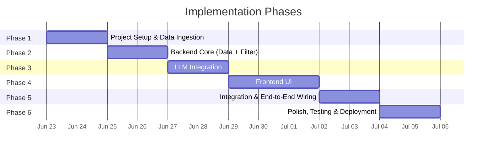
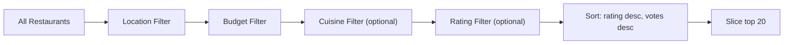
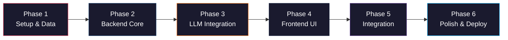

# Implementation Plan: AI-Powered Restaurant Recommendation System

> References: [architecture.md](file:///c:/Users/rparv/.antigravity-ide/Zomato%20milestone-1/docs/architecture.md) · [context.md](file:///c:/Users/rparv/.antigravity-ide/Zomato%20milestone-1/docs/context.md)

---

## Phase Overview



---

## Phase 1 — Project Setup & Data Ingestion

> **Goal**: Scaffold the Next.js project, configure tooling, and prepare the restaurant dataset.

### 1.1 Initialize Next.js Project

| Task | Details |
|------|---------|
| Scaffold app | `npx -y create-next-app@latest ./` with App Router, JavaScript, no Tailwind |
| Clean boilerplate | Remove default Next.js starter content |
| Create directory structure | `src/lib/`, `src/utils/`, `src/components/`, `data/`, `scripts/` |
| Environment config | Create `.env.local` with `GROQ_API_KEY` placeholder |
| Add `.gitignore` entries | Ensure `.env.local`, `node_modules/`, `data/` are ignored |

#### Files Created / Modified

| File | Action |
|------|--------|
| `package.json` | Auto-generated, add `groq-sdk` dependency later |
| `.env.local` | `GROQ_API_KEY=your_key_here` |
| `next.config.js` | Default config, verify App Router enabled |
| `src/app/layout.js` | Clean root layout with metadata |
| `src/app/page.js` | Placeholder home page |
| `src/app/globals.css` | Empty, ready for Phase 3 |

---

### 1.2 Data Ingestion Script

| Task | Details |
|------|---------|
| Create `scripts/ingest.js` | Node.js script to fetch and preprocess Hugging Face dataset |
| Fetch dataset | Download from [ManikaSaini/zomato-restaurant-recommendation](https://huggingface.co/datasets/ManikaSaini/zomato-restaurant-recommendation) |
| Parse & clean | Extract: `name`, `location`, `cuisine`, `costForTwo`, `rating`, `votes`, `restaurantType` |
| Normalize fields | Lowercase locations, compute `budgetTier` (low/medium/high), split cuisine strings into arrays |
| Generate IDs | Assign unique `id` to each record (`rest_001`, `rest_002`, …) |
| Output | Write `data/zomato_restaurants.json` |

#### Data Schema (per record)

```json
{
  "id": "rest_001",
  "name": "La Piazza",
  "location": "delhi",
  "cuisine": ["Italian", "Continental"],
  "costForTwo": 800,
  "budgetTier": "medium",
  "rating": 4.5,
  "votes": 1200,
  "restaurantType": "Casual Dining",
  "highlights": ["Outdoor Seating", "Family Friendly"]
}
```

#### Budget Tier Mapping

| Tier | Cost for Two (₹) |
|------|-------------------|
| `low` | ≤ 500 |
| `medium` | 501 – 1500 |
| `high` | > 1500 |

---

### 1.3 Utility Foundations

| File | Purpose |
|------|---------|
| `src/utils/constants.js` | Export lists of supported cities, cuisines, budget tiers |
| `src/utils/helpers.js` | Shared helpers: `normalizeString()`, `parseCuisine()`, `formatCurrency()` |

---

### Phase 1 — Verification Checklist

- [ ] `npm run dev` starts without errors
- [ ] `node scripts/ingest.js` produces a valid `data/zomato_restaurants.json`
- [ ] JSON file contains all expected fields with correct types
- [ ] Constants file exports meaningful city/cuisine lists derived from dataset

---

## Phase 2 — Backend Core (Data Loader + Filter Engine)

> **Goal**: Build the server-side data loading, filtering logic, and a basic API route that returns filtered results without LLM involvement.

### 2.1 Data Loader

| File | `src/lib/dataLoader.js` |
|------|-------------------------|
| **Purpose** | Load `zomato_restaurants.json` and cache in memory |
| **Exports** | `getRestaurants()` → returns full array (cached after first read) |
| **Caching** | Module-level variable; reads file only on cold start |
| **Error** | Throws descriptive error if file is missing |

```
// Pseudocode
let cache = null;

export function getRestaurants() {
  if (!cache) {
    cache = JSON.parse(fs.readFileSync('data/zomato_restaurants.json'));
  }
  return cache;
}
```

---

### 2.2 Filter Engine

| File | `src/lib/filterEngine.js` |
|------|---------------------------|
| **Purpose** | Filter restaurants by user preferences |
| **Exports** | `filterRestaurants(restaurants, preferences)` → filtered & sorted array |

#### Filter Pipeline



| Filter | Logic |
|--------|-------|
| **Location** | Exact match, case-insensitive (`restaurant.location === preferences.location.toLowerCase()`) |
| **Budget** | Match `budgetTier` field |
| **Cuisine** | If provided, check if any element in `restaurant.cuisine` array includes the search term (case-insensitive) |
| **Rating** | If provided, `restaurant.rating >= preferences.minRating` |
| **Sort** | Primary: `rating` descending · Tiebreaker: `votes` descending |
| **Limit** | Return top 20 candidates max |

---

### 2.3 API Route (Filter-Only)

| File | `src/app/api/recommend/route.js` |
|------|-----------------------------------|
| **Method** | `POST` |
| **Purpose** | Validate input → load data → filter → return filtered results (no LLM yet) |

#### Request/Response Contract

**Request Body:**
```json
{
  "location": "Delhi",
  "budget": "medium",
  "cuisine": "Italian",
  "minRating": 4.0,
  "extras": "family-friendly"
}
```

**Success Response (200) — Filter-only (Phase 2):**
```json
{
  "recommendations": [
    {
      "rank": 1,
      "name": "La Piazza",
      "cuisine": ["Italian", "Continental"],
      "rating": 4.5,
      "estimatedCost": "₹800 for two",
      "explanation": ""
    }
  ],
  "summary": "",
  "totalFiltered": 12,
  "timestamp": "2026-06-23T08:00:00.000Z"
}
```

**Error Responses:**

| Status | Code | When |
|--------|------|------|
| `400` | `VALIDATION_ERROR` | Missing `location` or `budget` |
| `500` | `INTERNAL_ERROR` | Dataset missing or unexpected error |

#### Pipeline Flow (Phase 2)

```
validate(body)
  → getRestaurants()
  → filterRestaurants(restaurants, preferences)
  → format top results as recommendations (without AI explanations)
  → return JSON response
```

---

### Phase 2 — Verification Checklist

- [ ] `dataLoader.js` reads JSON and caches correctly
- [ ] `filterEngine.js` returns correct results for various preference combos
- [ ] `POST /api/recommend` returns filtered results with correct schema
- [ ] Error cases return appropriate status codes and messages
- [ ] Boundary cases for filters work (budget tiers, rating thresholds)

---

## Phase 3 — LLM Integration

> **Goal**: Add the Groq LLM layer — prompt construction, API calls, response parsing — and wire it into the existing API route.

### 3.1 Prompt Builder

| File | `src/lib/promptBuilder.js` |
|------|----------------------------|
| **Purpose** | Construct a structured prompt for the Groq LLM |
| **Exports** | `buildPrompt(filteredRestaurants, preferences)` → `{ systemMessage, userMessage }` |

#### Prompt Structure

| Role | Content |
|------|---------|
| **System** | "You are a restaurant recommendation expert. Analyze the provided restaurant data and rank them based on the user's preferences. Return your response as valid JSON." |
| **User** | User preferences + formatted restaurant list + JSON response schema + instructions (rank top 5, explain each, provide summary) |

#### Design Decisions

- Request structured **JSON output** from the LLM for reliable parsing
- Cap context at **20 restaurants** to stay within token limits
- Include explicit **response schema** in the prompt

---

### 3.2 Groq LLM Client

| File | `src/lib/llmClient.js` |
|------|-------------------------|
| **Purpose** | Send prompts to Groq API and parse responses |
| **Exports** | `getRecommendations(systemMessage, userMessage)` → parsed JSON |

#### Implementation Details

| Aspect | Detail |
|--------|--------|
| **SDK** | `groq-sdk` npm package |
| **Model** | `llama-3.3-70b-versatile` (or latest available) |
| **Temperature** | `0.3` — low for consistent, factual output |
| **Max tokens** | `2048` |
| **Response format** | Request JSON; parse with `JSON.parse()` |
| **Error handling** | Catch API errors, rate limits (retry with exponential backoff, max 3 attempts) |
| **Fallback** | If JSON parsing fails, attempt repair; if still fails, return raw filtered data |

```
// Pseudocode
import Groq from 'groq-sdk';

const groq = new Groq({ apiKey: process.env.GROQ_API_KEY });

export async function getRecommendations(systemMessage, userMessage) {
  const response = await groq.chat.completions.create({
    model: 'llama-3.3-70b-versatile',
    messages: [
      { role: 'system', content: systemMessage },
      { role: 'user', content: userMessage }
    ],
    temperature: 0.3,
    max_tokens: 2048,
    response_format: { type: 'json_object' }
  });
  return JSON.parse(response.choices[0].message.content);
}
```

---

### 3.3 API Route Update (Add LLM)

| File | `src/app/api/recommend/route.js` |
|------|-----------------------------------|
| **Change** | Extend the Phase 2 route to include prompt building and LLM call |

**Updated Success Response (200):**
```json
{
  "recommendations": [
    {
      "rank": 1,
      "name": "La Piazza",
      "cuisine": "Italian",
      "rating": 4.5,
      "estimatedCost": "₹800 for two",
      "explanation": "..."
    }
  ],
  "summary": "...",
  "totalFiltered": 12,
  "timestamp": "2026-06-23T08:00:00.000Z"
}
```

**Additional Error Response:**

| Status | Code | When |
|--------|------|------|
| `503` | `LLM_ERROR` | Groq API failure after retries |

#### Updated Pipeline Flow (Phase 3)

```
validate(body)
  → getRestaurants()
  → filterRestaurants(restaurants, preferences)
  → buildPrompt(filtered, preferences)
  → getRecommendations(system, user)
  → return JSON response
```

---

### Phase 3 — Verification Checklist

- [ ] `promptBuilder.js` generates well-structured prompts
- [ ] `llmClient.js` successfully calls Groq API and returns parsed JSON
- [ ] `POST /api/recommend` returns AI-ranked recommendations with explanations
- [ ] LLM fallback works when JSON parsing fails
- [ ] Rate limit retry logic works (exponential backoff)
- [ ] Error cases return appropriate `503` status codes

---

## Phase 4 — Frontend UI

> **Goal**: Build a premium, visually stunning user interface with preference form and recommendation display.

### 4.1 Design System & Global Styles

| File | `src/app/globals.css` |
|------|------------------------|
| **Purpose** | Design tokens, reset, typography, animations |

#### Design Tokens

| Token Category | Examples |
|---------------|----------|
| **Colors** | Dark background (`hsl(220, 20%, 8%)`), accent gradient (orange → red Zomato-inspired), card surfaces with glassmorphism |
| **Typography** | Google Font: `Outfit` (headings) + `Inter` (body) |
| **Spacing** | 4px base unit system |
| **Radius** | `12px` cards, `8px` inputs, `24px` pills |
| **Shadows** | Layered elevation system |
| **Animations** | `fadeIn`, `slideUp`, `shimmer` (loading), `pulse` keyframes |

#### Key CSS Features

- Dark mode primary design
- Glassmorphism card effects (`backdrop-filter: blur()`)
- Smooth gradient accents
- Micro-animation transitions on hover/focus
- Responsive breakpoints (mobile-first)

---

### 4.2 Components

#### `Header.js`

| Aspect | Detail |
|--------|--------|
| **Content** | App logo/name ("Zomato AI"), tagline |
| **Style** | Gradient text, sticky header with blur backdrop |

#### `PreferenceForm.js`

| Aspect | Detail |
|--------|--------|
| **Inputs** | Location (dropdown), Budget (radio/pill selector), Cuisine (dropdown), Min Rating (slider/select), Extras (text input) |
| **Validation** | Client-side: location and budget required |
| **State** | React `useState` for each field + loading + error states |
| **Submit** | `fetch('/api/recommend', { method: 'POST', body })` |
| **UX** | Animated field focus, pill-style budget selector, smooth transitions |

#### `LoadingSpinner.js`

| Aspect | Detail |
|--------|--------|
| **Style** | Skeleton cards with shimmer animation |
| **When** | Displayed while awaiting API response |

#### `RecommendationCard.js`

| Aspect | Detail |
|--------|--------|
| **Props** | `rank`, `name`, `cuisine`, `rating`, `estimatedCost`, `explanation` |
| **Layout** | Glassmorphism card with rank badge, star rating display, cost pill, AI explanation paragraph |
| **Animations** | Staggered `slideUp` entrance, hover lift effect |

#### `RecommendationList.js`

| Aspect | Detail |
|--------|--------|
| **Props** | `recommendations[]`, `summary` |
| **Layout** | Summary banner + responsive grid of `RecommendationCard` |
| **Empty state** | Friendly message when no results match |

#### `Footer.js`

| Aspect | Detail |
|--------|--------|
| **Content** | Credits, "Powered by Groq", dataset attribution |

---

### 4.3 Home Page Assembly

| File | `src/app/page.js` |
|------|---------------------|
| **Layout** | Hero section → `PreferenceForm` → `LoadingSpinner` (conditional) → `RecommendationList` (conditional) |
| **State** | `recommendations`, `loading`, `error` managed via `useState` |
| **Flow** | Form submit → set loading → fetch API → set recommendations → render cards |

### 4.4 Root Layout

| File | `src/app/layout.js` |
|------|----------------------|
| **Metadata** | Title: "Zomato AI — Smart Restaurant Recommendations" · Description for SEO |
| **Fonts** | Import `Outfit` + `Inter` from Google Fonts via `next/font` |
| **Structure** | `<Header />` + `{children}` + `<Footer />` |

---

### Phase 4 — Verification Checklist

- [ ] All components render without errors
- [ ] Form validation works (required fields highlighted)
- [ ] Loading spinner appears during API call
- [ ] Recommendation cards display all fields correctly
- [ ] Responsive design works on mobile, tablet, desktop
- [ ] Hover effects and animations feel smooth and polished
- [ ] Empty state displays when no restaurants match

---

## Phase 5 — Integration & End-to-End Wiring

> **Goal**: Connect frontend to backend, test the full flow, and handle edge cases.

### 5.1 End-to-End Integration

| Task | Details |
|------|---------|
| Wire form submission | `PreferenceForm` → `POST /api/recommend` → parse response → render `RecommendationList` |
| Error display | Show user-friendly error messages from API error responses |
| Loading states | Seamless transition: idle → loading → results/error |
| Empty results | Display "No restaurants match your preferences. Try adjusting your filters." |

### 5.2 Edge Case Handling

| Scenario | Frontend Handling |
|----------|-------------------|
| Network error | Show retry button with error message |
| Slow response (> 5s) | Show "Still searching…" message |
| Malformed API response | Graceful fallback to error state |
| Empty recommendations | Display helpful suggestion to broaden filters |
| Very long AI explanation | Truncate with "Read more" expansion |

### 5.3 Full Flow Test Scenarios

| # | Test Case | Expected Outcome |
|---|-----------|------------------|
| 1 | Valid preferences (Delhi, medium, Italian, 4.0) | 5 ranked recommendations with explanations |
| 2 | Only required fields (Bangalore, low) | Recommendations across all cuisines |
| 3 | Very restrictive filters (niche cuisine, high rating) | Fewer results or empty state message |
| 4 | Missing location | Form validation prevents submission |
| 5 | API key missing/invalid | 503 error with user-friendly message |

---

### Phase 5 — Verification Checklist

- [ ] Full flow works: form → API → results displayed
- [ ] All 5 test scenarios pass
- [ ] Error states render correctly
- [ ] Loading transition is smooth
- [ ] No console errors in browser

---

## Phase 6 — Polish, Testing & Deployment

> **Goal**: Final visual polish, performance optimization, and deployment readiness.

### 6.1 Visual Polish

| Task | Details |
|------|---------|
| Typography audit | Ensure consistent font usage, sizing, and weight hierarchy |
| Color consistency | Verify all elements use design tokens, no hard-coded colors |
| Animation timing | Fine-tune all transition durations and easing curves |
| Mobile polish | Test and fix any overflow, spacing, or touch target issues |
| Accessibility | Ensure form labels, focus indicators, ARIA attributes, and color contrast |

### 6.2 Performance Optimization

| Task | Details |
|------|---------|
| Bundle analysis | Check `next build` output for large chunks |
| Image optimization | Use `next/image` for any static assets |
| Font loading | Use `next/font` `display: swap` to prevent FOIT |
| API response caching | Add `Cache-Control` headers for repeated identical queries |
| Lighthouse audit | Target 90+ on Performance, Accessibility, Best Practices, SEO |

### 6.3 SEO

| Element | Value |
|---------|-------|
| `<title>` | "Zomato AI — Smart Restaurant Recommendations" |
| `<meta description>` | "Get personalized AI-powered restaurant recommendations based on your location, budget, cuisine preference, and more." |
| `<h1>` | Single, descriptive heading on home page |
| Semantic HTML | Proper `<main>`, `<section>`, `<article>`, `<form>` usage |
| Open Graph | Title, description, and image meta tags |

### 6.4 README

| File | `README.md` |
|------|-------------|
| **Sections** | Project overview, features, tech stack, setup instructions, environment variables, usage, screenshots, license |

### 6.5 Deployment Preparation

| Task | Details |
|------|---------|
| Environment variables | Document required `GROQ_API_KEY` setup |
| Build test | `npm run build` completes without errors |
| Production test | `npm start` serves the production build correctly |
| Vercel config | Ensure `data/zomato_restaurants.json` is included in deployment |

---

### Phase 6 — Verification Checklist

- [ ] `npm run build` succeeds with no warnings
- [ ] Production build runs correctly via `npm start`
- [ ] Lighthouse scores ≥ 90 across all categories
- [ ] README is complete and accurate
- [ ] All environment variables documented
- [ ] Application works end-to-end in production mode

---

## Summary: Phase Dependencies



| Phase | Focus | Key Deliverables |
|-------|-------|------------------|
| **1** | Setup & Data | Next.js scaffold, `ingest.js`, `zomato_restaurants.json`, constants |
| **2** | Backend Core | `dataLoader`, `filterEngine`, API route (filter-only) |
| **3** | LLM Integration | `promptBuilder`, `llmClient`, API route update with AI |
| **4** | Frontend UI | Design system, all 6 components, home page assembly |
| **5** | Integration | End-to-end wiring, edge case handling, flow testing |
| **6** | Polish & Deploy | Visual polish, performance, SEO, README, production build |
